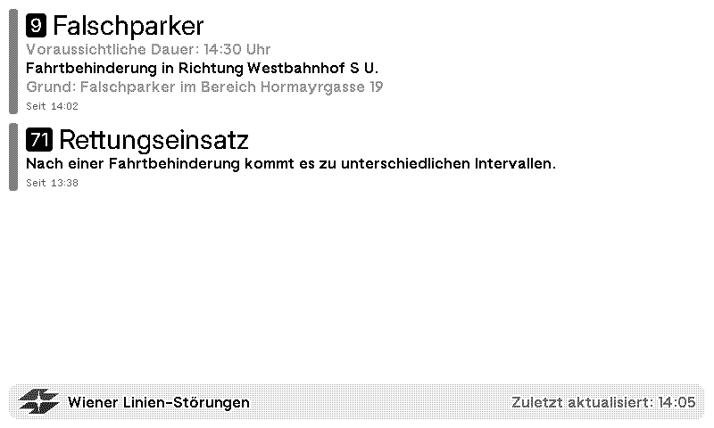
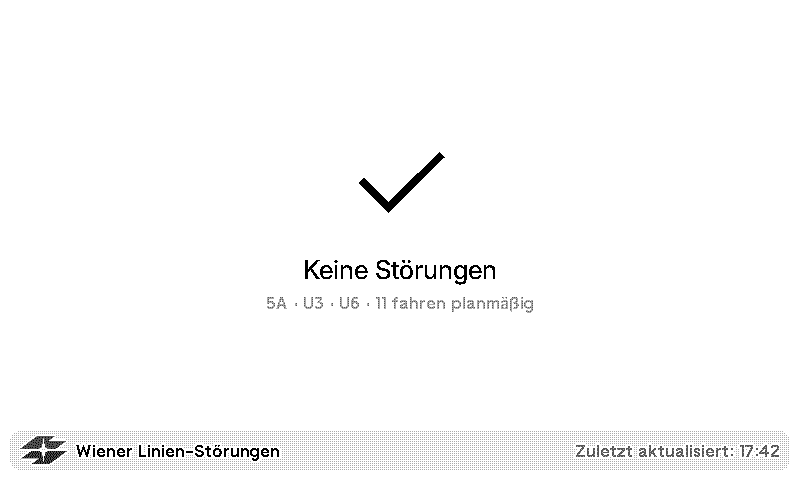

# TRMNL Vienna Public Transport Disruptions

A TRMNL plug-in to check for Vienna public transport disruptions by fetching https://www.wienerlinien.at/ogd_realtime/trafficInfoList?relatedLine using the added public transport lines.

## Credits
Data provided by Wiener Linien

Image loaded via wikipedia.org
