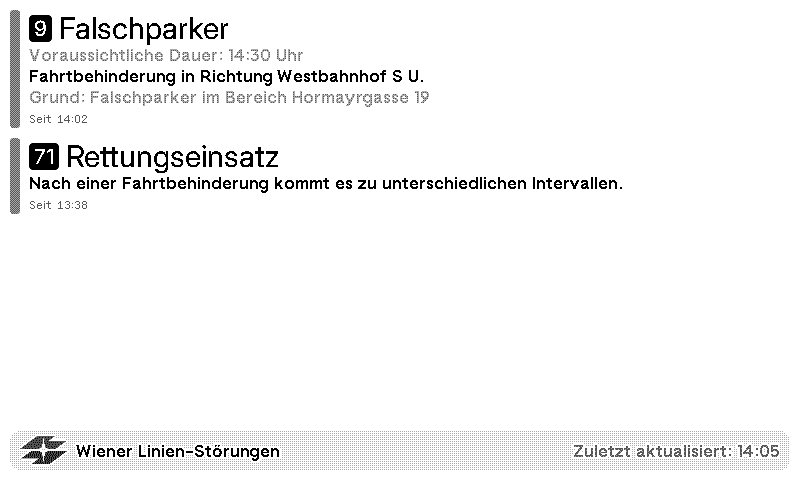
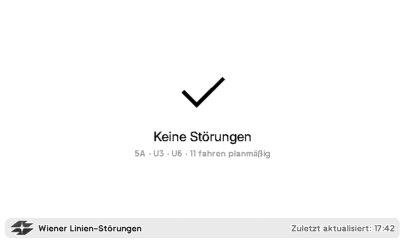

# TRMNL Vienna Public Transport Disruptions
 


A TRMNL plug-in to check for Vienna public transport disruptions by fetching https://www.wienerlinien.at/ogd_realtime/trafficInfoList?relatedLine using the added public transport lines.

<a href="https://trmnl.com/recipes/250757">
  
</a>

## Settings

| Field | Purpose |
|---|---|
| Wiener Linien Public Transport Lines | One line per field, e.g. `U1`, `49`, `8A` |
| Stop IDs (optional) | Narrow disruptions down to specific stops |
| Excluded Keywords (optional) | Hide disruptions whose title or description contains one of these words, e.g. `Bauarbeiten` |
| Maximum Age (days, optional) | Hide long-running disruptions that started more than this many days ago |
| Sort Order | Newest first, or grouped by the order the lines were entered |
| Compact Mode | Show line, title and start time only — off, half and quadrant layouts only, or all layouts |

## Development

The templates live in `src/` and are deployed by the GitHub Actions workflow: every push to `main` runs `trmnlp lint` and then `trmnlp push`, which updates the plugin referenced by the `id` in `src/settings.yml`. Edit the plugin here rather than in the TRMNL web editor, otherwise changes are overwritten on the next push.

For a local preview install [trmnlp](https://github.com/usetrmnl/trmnlp) and run:

```sh
trmnlp serve   # http://localhost:4567
```

Custom field values for the local server are preset in `.trmnlp.yml`, which is not uploaded to TRMNL. Note that trmnlp percent-encodes commas in the polling URL, which the Wiener Linien API reads as a single unknown line — preview one line at a time.

## Credits
Data provided by <a href="https://www.wienerlinien.at/open-data">Wiener Linien</a>  
Image loaded via <a href="https://www.wikipedia.org/">Wikipedia.org</a>
